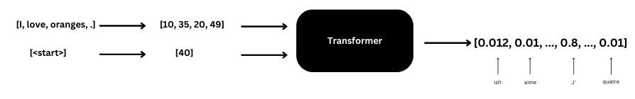
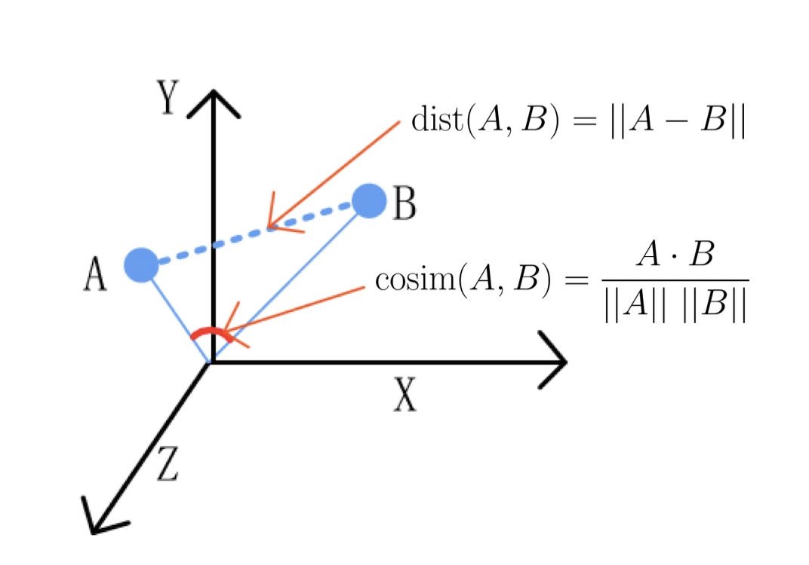
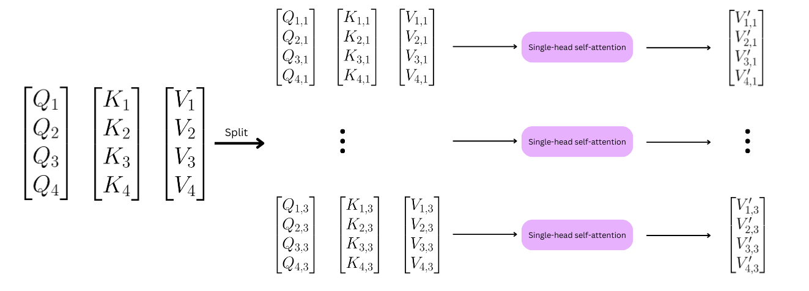

## Introduction
A transformer is a type of neural network model that can be used to transform a sequence of vectors to another sequence of vectors. This makes it useful for various natural language processing tasks, such as translation, where a sentence can be viewed as a sequence of word vectors. It can also be used for image captioning, where an image can be viewed as a sequence of mini patches (mini images), and the transformer can transform this sequence of patches to a sequence of words that describe the image.
Many popular language AI models, including ChatGPT, are built using the transformer architecture. Image generating models such as DALL-E also use transformer to encode the prompt, which is then used to generate an image.


## Overview
I personally find it easier to figure out how to use something before understanding how it functions. That way when understanding how it works, I already know what to expect in the input and the output. So for now, let's treat the transformer as a black box, and let's see how it works during the inference and training for the language translation task.

### Inference
During inference, the transformer predicts one token at a time, taking into account the previously predicted tokens as input and generating the next token in the sequence. For natural language processing tasks such as machine translation, the transformer takes in the source sentence as input and uses the previously predicted words of the translated sentence as additional input to generate the next word following each previously predicted words in the translated sequence.


So, for example, during translation, the transformer takes in the *source sentence* and the *currently predicted sentence* as input and generates the next word in the translated sentence based on both inputs. It repeats this process, taking the previously predicted words and the source sentence as input at each step, until the full translated sentence is generated.

Let's take a look with a detailed example.

Suppose the transformer is already trained and we want it to translate "I love oranges." to French.
The desired output sentence is `J'aime les oranges.`

The *source sentence* is `["I", "love", "oranges", "."]`.

Since it's the beginning of the inference, the currently predicted sentence is empty, but we cannot feed an empty sentence in the transformer so we start with `["<start>"]` as our *currently predicted sentence*.

So we start with these two sequences: `["I", "love", "oranges", "."]` and `["<start>"]`.

We then tokenize these sequences (convert each word to a number representing it). for example `["I", "love", "oranges", "."]` $\rightarrow$ `[10, 35, 20, 49]` and `["<start>"]` $\rightarrow$ `[40]`

The transformer then takes in input those two sequences, then generates *one* probability distribution over the entire vocabulary, which represents the likelihood of each possible next word. The output of the transformer is a vector of size equal to the vocabulary size, with each element corresponding to the probability of the corresponding word that follows the `<start>` token in the sequence.



Since we supposed that the transformer is already trained, then the word with the highest probability is `J'`. We add `J'` to the *currently predicted sentence*.

So now we have `["I", "love", "oranges", "."]` and `["<start>", "J'"]`.
With tokenization, we have `[10, 35, 20, 49]` and `[40, 20]`, assuming `20` represents `J'`.
Notice that we have two different tokenizers for English and French.

The transformer then takes in input these sequences, then generates *two* probabilities distributions, the first one representing the likelihood of the possible word that follows the `<start>` token, and the second one representing the likelihood of the possible word that follows the `J'` token.


Notice that the first probability vector is the same as the previous one. This is because the transformer always generates the same prediction for the previous time step's prediction, due to a causal mask that prevent tokens from attending future tokens; which we will discuss this later in the transformer architecture section.
Since we have already predicted the next word following the `<start>` token in the previously generated sequence, we can ignore the first probability distribution and focus only on the second one.

Again, since the transformer is already trained, we can suppose that the word with the highest probability is `aime`.

So we get `["I", "love", "oranges", "."]` and `["<start>", "J'", "aime"]`

We repeat this process until the transformer generates the `<end>` token, which indicates that the generated sequence is complete. The transformer is trained to predict the `<end>` token appropriately during the training phase, allowing us to determine when to stop the generation loop.

The following is an example "pseudo-python" code that demonstrates the inference phase.
```python
source_sentence = ["I", "love", "oranges", "."]
current_pred = ["<start>"]

while current_pred[-1] != "<end>":
	src = tokenize1(source_sentence)
	cur = tokenize2(current_pred)

	pred = transformer(src, cur)
	next_token = argmax(pred[-1])
	next_word = untokenize2(next_token)

	current_pred.append(next_word)

print(current_pred)  # ["<start>", "J'", "aime", "les", "oranges", ".", "<end>"]
```

### Training
The training phase differs from the inference phase in a sense that all tokens of the target sentence are predicted simultaneously instead of one at a time. 
For example, if the source sentence is "I love oranges." and the target sentence is "J'aime les oranges.", the transformer is given the entire source sentence `["I", "love", "oranges", ".",]` and the complete translated sentence `["<start>", "J'", "aime", "les", "oranges", "."]` and we want that it to: 
 - from `["<start>"]` predict `J'`
 - from `["<start>", "J'"]` predict `aime`
 - from `["<start>", "J'", "aime"]` predict `les`
 - from `["<start>", "J'", "aime", "les"]` predict `oranges`
 - from `["<start>", "J'", "aime", "les", "oranges"]` predict `.`
 - from `["<start>", "J'", "aime", "les", "oranges", "."]` predict `<end>`

The cool thing about transformer is that during training it doesn't have to predict every tokens sequentially, but in parallel so it will predict the whole sentence in one step, which makes the training process much faster. 
Here's the ideal schema of what we want the transformer to predict during the training:


So the target sentence is `["J'", "aime", "les", "oranges", ".", "<end>"]`
Notice the target sentence length is 6.
To calculate the loss, we first tokenize the target sentence, then convert it into one-hot vectors equal to the size of the vocabulary.

Next, the transformer outputs six vectors of the vocabulary size, which we apply the softmax function to, resulting in 6 probability vectors. We can then compute the cross-entropy loss between the predictions and the target.


```python
src = ["I", "love", "oranges", "."]
tgt = ["<start>", "J'", "aime", "les", "oranges", ".", "<end>"]

src = tokenize1(src)
tgt = tokenize2(tgt)

inp_tgt = tgt[:-1]
out_tgt = tgt[1:]

pred = transformer(src, inp_tgt)

out_tgt = one_hot(out_tgt)
loss = crossentropy(pred, out_tgt)

# then do backprop
```

## Architecture


In the transformer, two sequences are fed as inputs: `Inputs` and `Outputs (shifted right)`.


In the case of machine translation, the `Inputs` sequence represents the source sentence to be translated, while the `Outputs (shifted right)` sequence represents the partially translated sentence currently being predicted during inference, or the fully translated sentence during training. 
For question-answering tasks, the `Inputs` sequence would correspond to the question, while the `Outputs (shifted right)` sequence would represent the partially answered sentence during inference and the complete answer during training. 
Similarly, in image captioning tasks, the `Inputs` sequence would represent the image, which is a sequence of mini-patches, while the `Outputs (shifted right)` sequence would represent the currently predicted caption during inference and the complete caption during training.

### 1. Input embedding


Input embedding layer are used to project vectors into latent space. This layer varies depending the task, so let's limit ourselves to NLP tasks. In this case, this layer is used to convert tokens (words) into vectors of features (called `embeddings`) by associating each token with a vector of size `d_model` (a hyperparameter) that ideally represents some features of the word.


Here for instance, the token `10` is associated with the vector `[0.2, -0.5, ..., 1.2, -0.7]` and so on.

Here's is a pseudo-python code on how to create this layer:
```python
embedding_matrix = ... # shape (vocabulary size, d_model)

inputs = ['I', 'love', 'natural', 'language', 'processing']
indices = tokenize(inputs)  # for example [20, 45, 11, 32, 90]

embeddings = embedding_matrix[indices]  # shape (5, d_model)
```

In Pytorch, we can easily create this layer:
```python
input_emb = nn.Embedding(num_embeddings=vocab_size, embedding_dim=d_model)
```

The values in the vector associated with each token are determined by the transformer through backpropagation. During training, the transformer adjusts the values in the vector so that they represent the most useful and informative features of the token for the given task. In this way, the input embedding layer allows the transformer to convert tokens into vectors that capture their semantic meaning, and the values in the vector are learned through the training process.

Intuitively, we can imagine that synonyms words will have 'similar vectors'. And antonyms words will have 'different vectors'.

#### Similarity
But... what does 'similar vectors' mean? What does 'different vectors' mean?
How do we measure the similarity between two vectors?

Two most popular ways to measure distance between two vectors are Euclidean distance and Cosine similarity.



In most NLP tasks, we like to use cosine similarity.

Let's understand why through an example:
	We know that cosine similarity looks at the angle between two vectors, and euclidian similarity at the distance between two points, let's say we are in an e-commerce setting and we want to compare users for product recommendations:

	-   User 1 bought 1x eggs, 1x flour and 1x sugar.
	-   User 2 bought 100x eggs, 100x flour and 100x sugar
	-   User 3 bought 1x eggs, 1x Vodka and 1x Red Bull
	By cosine similarity, user 1 and user 2 are more similar. 
	By euclidean similarity, user 3 is more similar to user 1. 
	This is why we prefer to use consine similarity.

So intuitively, if two words are synonymous, then their cosine similarity score would be high, if they are antonymous, then their cosine similarity score would be negative, and if they are unrelated, then their cosine similarity score would be close to zero i.e. the vectors are orthogonal.`

### 2. Positional encoding


The transformer process every tokens in parallel, thus it doesn't know the position of each token in the sequence. Which is why we need to encode the position of each token in the sequence or otherwise, for the transformer, these two sentences would be the same:
 - I like oranges and I don't like apples.
 - I like apples and I don't like oranges.

The idea is to create a vector of size `d_model` for each position in the sequence and add the corresponding vector to the embedding of each token. This way, the transformer can distinguish between tokens based on their position in the sequence.


```python
tokens = tokenize1(["I", "love", ..., "."])
embeddings = input_embedding(tokens) # shape (sequence length, d_model)

positional_embeddings = get_position_encoders(shape=(sequence_length, d_model)) # shape (sequence length, d_model)
embeddings = embeddings + positional_encoding
```

#### Intuition
When we add `positional embeddings` to the `embeddings`, we aim to capture the position of each token in the sequence. Intuitively, we can understand that by doing so, we move the `embedding` closer to the cluster of their corresponding position in the multidimensional space. For instance, if the embedding of the word "car" is located somewhere in the space of `d_model` dimensions, and the cluster of all the words at the first position is located a bit to the left, then by adding the positional embedding, we move the vector corresponding to "car" a bit to the left, closer to the cluster of all the words of the first position. This helps the model to differentiate between words with similar embeddings but different positions in the sequence.


#### Ideas
So now the question is, how to create these positional embeddings?
One way to generate them is to add a fixed vector to each embedding that encodes the position of the word. For instance, to encode the position of the first word, we could add the vector `[1, 1, ..., 1]` to its embedding, and for the second word, we could add the vector `[2, 2, ..., 2]` and `[k, ..., k]` to the $\text{k}^{th}$ word. However, this approach can lead to very large positional encodings that dominate the embeddings and make it harder for the transformer to extract features from them.

One can try to compose with a bounded function such as the sigmoid function i.e `sigmoid([k, ..., k])` but it can be problematic because when the values become too high, the gradient of the sigmoid function approaches zero, making it difficult for the transformer to differentiate between two positional embeddings. This can limit the effectiveness of using positional embeddings in the transformer.


#### Transformer's positional encoding
In the original paper, *Attention is all you need*, the authors chose to use a scary-looking positional encoding:


We can see that this positional encoding ensures the uniqueness of each position, and the difference between two positional embeddings are always noticeable.

#### Why not concatenating
cuz addition = less memory and we get similar results.

#### Why not learned positional embeddings
Quote from the original paper: "We also experimented with using learned positional embeddings [9] instead, and found that the two versions produced nearly identical results (see Table 3 row (E)). We chose the sinusoidal version because it may allow the model to extrapolate to sequence lengths longer than the ones encountered during training."


### 3. Multi-head Self Attention


#### 3.1 Single-head Self-Attention
#### Intuition
Consider the sentence "I love eating orange.".
The word "orange" can hold two distinct meanings, either referring to the colour or the fruit. Our objective is to determine the intended meaning of "orange" in the given context.
So the idea here is we want to search for other *key* words to help us to determine the intended meaning of the *query* word (i.e the word we are interested in, which in this cas is "orange").

One way of doing this is to try and compute the similarity score using the dot product between the query word and all the words in the sentence. This helps us to identify which of the contextual words are most closely related to the query word, allowing us to use them as the "keys" to extract the intended meaning of our query.


After obtaining the similarity scores, we can construct a semantically enriched vector representation for the word "orange". This is done by performing a weighted sum of all the vectors from the sentence. The weighting for each vector is determined by the softmax of the corresponding similarity score. In essence, this process emphasizes the influence of context words that have higher similarity scores, thereby encapsulating a more precise semantic meaning for our query word, "orange".


Intuitively, the process of applying the weighted sum nudges the original vector for "orange" towards the fruit-related cluster in the vector space.

#### Details
This layer takes in input a sequence of vectors generated by our embedding and positional encoding layers. 

For each vector of the sequence, three vectors are generated - the Query, Key, and Value vectors (Q, K, and V respectively) using 3 linear layers. These vectors are learned representations that encapsulate different aspects of the word's semantics in the context of the sentence. 


Next, to understand the contextual meaning of our query word $Q_i$, we compute dot products between each query vector $Q_i$ and the key vectors $(K_j)_{j}$ of all other words in the sentence. This yields a set of similarity scores, signifying how closely each word in the sentence relates to $Q_i$, and we do this for each $i$.


Let's understand why we employ distinct vector representations - Query (Q), Key (K), and Value (V) - for each word rather than using a single vector representation for all three purposes.

	Consider a situation where the query word is "network". 
	In this context, we would desire words like "neural" and "social" to generate high similarity scores, 
	as the phrases "neural network" and "social network" are prevalent in language.
	This indicates that the dot product between the query vector and the key vectors for these words would be high, 
	implying their similarity.
	
	However, while "neural" and "social" may serve as similar keys in relation to "network", 
	their value vectors must differ significantly because they pertain to distinct topics. 
	If we used the same vector representation for both keys and values, this differentiation would not be possible. 

Following that, a softmax function is applied to these scores. The softmax function essentially transforms the scores into a probability distribution, allowing the most relevant words to have higher weights.

We can parallelise the dot products computation of all queries and keys but doing a matrix product: $$\text{score} = \text{softmax}\left(Q K^\top\right)$$
In reality, before doing the softmax, we divide by the factor $\sqrt{d}$ where $d$ is the number of features of each vector $Q_i$: 
$$\text{score} = \text{softmax}\left(\frac{Q K^\top}{\sqrt{d}}\right)$$
The final step involves creating a new vector for each $Q_i$. This is achieved by calculating the weighted sum of the value vectors $(V_j)_j$ of all words in the sentence, where the weights are the softmax scores. This process shifts the original vector of $Q_i$ towards a more accurate semantic meaning position in the vector space, giving a semantically rich representation in the context of the sentence.

We can also parallelise to get all new $(V_j')_j$ by using a matrix product: $$V' = \text{score} \cdot V$$
Illustration:


#### 3.2 Multi-head Self-Attention
In the single-head attention mechanism, we apply the attention process once on the input data. For multi-head attention, we apply this process multiple times (hence "multi-head"): 
Given an input sequence of vectors with shape $(S, F)$, where S is the sequence length and $F$ is the feature size, we first split $F$ into $h$ parts, each with size $F/h$. This corresponds to the creation of the "heads" in multi-head attention. 
For each head, the input is of shape $(S, F/h)$, we have a subset of the features for each word in the sentence, and we can apply the single-head attention mechanism to this subset of features. This results in h sets of output vectors, each with shape $(S, F/h)$.

The intuition here is that each head can focus on a different aspect of the input data. By splitting the features between heads, we allow each head to specialise in certain types of relationships.

Once we have the output from each head, we need to recombine these outputs to get our final sequence of vectors. This is done by concatenating the outputs from all heads along the feature axis, resulting in a tensor of shape $(S, F)$.

The splitting is illustrated below:


Then we pass each head through a single-head self-attention layer:




Then, to transform this back to our original feature space, we apply a final linear transformation. The weights of this transformation are learned during the training process, allowing the model to determine the best way to integrate the information from all the heads.

The entire process can be represented as:

$$\text{MultiHead}(Q,K,V)=\text{Concat}(\text{head}_1,…,\text{head}_h)W_O$$
where  $$\text{head}_i=\text{Attention}(Q^{(i)},K^{(i)},V^{(i)})$$

The MultiHead operation's output will be a tensor with shape $(S, F)$, just like the original input.
Here's an example of code for the MHA layer:
```python
class MultiHeadAttention(nn.Module):
    def __init__(self, F, num_heads):
        super(MultiHeadAttention, self).__init__()
        self.F = F
        self.num_heads = num_heads
        self.depth = F // num_heads

        # Define the linear layers for Q, K and V
        self.wq = nn.Linear(F, F)
        self.wk = nn.Linear(F, F)
        self.wv = nn.Linear(F, F)

        # Define the output linear layer
        self.dense = nn.Linear(F, F)
        
    def split_heads(self, x, batch_size):
        # Split the last dimension into (num_heads, depth)
        x = x.view(batch_size, -1, self.num_heads, self.depth)
        # Transpose to the format of (batch_size, num_heads, seq_len, depth)
        return x.transpose(1, 2)

    def forward(self, q, k, v):
        batch_size = q.size(0)

        # Linear transformations
        q = self.wq(q)
        k = self.wk(k)
        v = self.wv(v)

        # Split into multiple heads
        q = self.split_heads(q, batch_size)
        k = self.split_heads(k, batch_size)
        v = self.split_heads(v, batch_size)

        # Calculate the attention weights
        scores = torch.matmul(q, k.transpose(-2, -1)) / math.sqrt(self.depth)
        attention_weights = F.softmax(scores, dim=-1)

        # Apply the attention weights to v
        context = torch.matmul(attention_weights, v)

        # Concatenate the context from each head and pass through the final linear layer
        context = context.transpose(1, 2).contiguous().view(batch_size, -1, self.F)
        output = self.dense(context)

        return output

```

### Feed-forward


The feedforward layer in the Transformer model consists of two linear transformations with a GELU activation in between. It's relatively straightforward compared to the attention mechanism.

Each vector in the sequence from the the MHA layer is transformed by the first linear layer, which projects the input into a higher dimensional space, typically to a dimension four times the size of the original one. This is akin to creating a "richer" representation of each word.

Then a second linear layer is used to transform the high-dimensional vectors back to the original dimensionality. This second linear layer brings the "richer" representations back to a form compatible with the rest of the model.


### Add & Norm

The Add & Norm (Addition and Normalization) layer helps stabilize the outputs of the Multi-Head Attention and Feedforward layers and also assists in training deep networks.

The Add & Norm layer consists of two primary operations:

1. **Residual Connection (Add):** The outputs from the Multi-Head Attention layer and the Feedforward layer are each added to their original input (prior to these layers), hence creating a shortcut or a "residual connection". This addition operation is element-wise, ensuring that the dimensions of the input and the output remain the same. These residual connections help in mitigating the problem of vanishing gradients. 
    
2. **Layer Normalization (Norm):** The addition operation is followed by Layer Normalization. Unlike Batch Normalization, which normalizes over the batch dimension, Layer Normalization operates over the feature dimension. This normalization stabilizes the network’s learning by re-centering and re-scaling the layer outputs, leading to faster convergence and improved generalization in deep learning models.
    


### Stack multiple encoder layers


The complexity and power of the Transformer model stem not just from the multi-head attention and feedforward layers, but also from the stacking of multiple such encoder layers. This architecture allows the model to extract and process increasingly abstract representations of the input data, thus learning complex patterns and relationships.


### Decoder layer

#### Output embedding


Same idea as `Input embedding`.

### Masked Multi-Head Attention
We saw that the Multi-Head Attention mechanism plays a vital role in understanding the relationships between vectors in a sequence. However, when predicting a token during the training or inference phase, we want to ensure that the prediction for a particular token position doesn't depend on the words that come after it. This is where Masked Multi-Head Attention comes in.

Masked Multi-Head Attention is very similar to standard Multi-Head Attention with one key difference. It uses a mask to ensure that each position in the self-attention mechanism can only attend to earlier positions in the sequence.

Consider the example sentence "I love eating oranges.". When predicting the word "eating", we want the model to only consider "I" and "love", and not "eating" nor "oranges." or any word that comes after "eating". Therefore, we apply a mask that removes (or significantly reduces the impact of) the future words.

This masking operation is usually implemented by setting extremely large negative values (often `-inf` or `-1e9`) to the relevant positions in the attention scores matrix, right before the softmax step. This causes the softmax function to output near-zero values for these positions, effectively ignoring the masked positions during attention calculation.
The mask is typically a triangular matrix that is applied to the attention scores matrix.

For example, if we have a sequence of 5 words, the attention scores matrix might look like this before applying the mask:


So our `score` formula would become: $$\text{score} = \text{softmax}\left(\frac{QK^\top}{\sqrt{d}} + \text{mask}\right)$$
### Multi-head Cross Attention


The Multi-Head Cross Attention is a mechanism used in the decoder to pay attention to the corresponding output from the encoder.

In the standard Multi-Head Attention, the queries, keys, and values all come from the same place. However, in the Multi-Head Cross Attention, the queries come from the previous decoder layer, and the keys and values come from the output of the encoder stack. This allows every position in the decoder to attend to all positions in the input sequence, hence "cross-attention".


This form of attention allows the decoder to focus on different parts of the encoder outputs for every step of the decoder's own outputs.

For example, if the task is translation and the input sentence is "I love eating oranges", when generating the translated word for "oranges", the model can focus more on the encoded representation of "oranges" through the cross-attention mechanism.

The formula used to calculate the cross-attention is the same as for the standard multi-head attention:

$$\text{score}=\text{softmax}\left(\frac{QK^\top}{\sqrt{d}}\right)$$
$$V'=\text{score} \cdot V$$

Again, just as in the standard multi-head attention, the computations can be parallelized over all query and key vectors.

### Stack decoder layers
Same reason as stacking encoder layers.

### Last linear layer and softmax

The layer is acts as a classifier to predict the next word. We apply this to each vector of our sequence. As such, each output vector from this layer corresponds to the prediction of the next token in the sequence.

Take for instance the input "I love eating oranges", with the corresponding output "J'aime manger". Ideally, the output from the final linear layer should predict the subsequent tokens, which in this case would be "aime manger les".

### Key padding mask
In natural language processing tasks, a common issue is dealing with variable-length sentences. While some sentences might be relatively short, others could be significantly longer. However, when processing sentences in batches, our model expects all inputs in the batch to be of the same shape.

To address this, we use padding: we artificially extend the length of all sentences in the batch to match the length of the longest sentence by adding "padding tokens" to the shorter sentences.

However, these padding tokens are artificial and do not carry any real semantic meaning, and we don't want our model to pay attention to these tokens while learning from the data. This is where "key padding masks" come into play.

A key padding mask is a binary tensor that indicates where padding tokens are in the sentence. In this tensor, the value of 1 indicates a padding token, and a value of 0 indicates a real token. For instance, consider a sentence "I love eating oranges", which has been padded to length 7: "I love eating oranges PAD PAD PAD". The corresponding key padding mask would be: [0 0 0 0 1 1 1].

When computing attention scores, we use this mask to ensure that the model does not pay attention to the padding tokens. This is usually done by setting the attention scores of the padding tokens to a very large negative number before applying the softmax function. This ensures that the softmax of these scores is essentially zero, so the attention weights for the padding tokens are also zero.

Here's an illustration of how key padding mask works in the Multi-Head Attention layer:


Let's consider this example, "love" being the query and the keys being the sequence "I love eating oranges PAD PAD PAD".

We calculate the dot product between "love" and all the keys of the sequence, we get for example this score:
```python
scores = [1.2, 5.7, 0.8, 2.1, 0.3, 0.4, 0.2]
```
Here, each value is the raw dot product score for "love" with "I", "love", "eating", "oranges", "PAD", "PAD", and "PAD" respectively.

Next, we would apply the key padding mask. The mask for our sentence would be [0, 0, 0, 0, 1, 1, 1], where 0's represent actual tokens and 1's represent padding tokens.

Applying the mask replaces the scores corresponding to padding tokens with `-inf`:
```python
scores = [1.2, 5.7, 0.8, 2.1, -inf, -inf, -inf]
```

Then, when we apply the softmax function  the padding positions will yield zero:
```python
attention_weights = [0.03, 0.88, 0.02, 0.07, 0, 0, 0]
```

Since these weights show how much attention should be paid to each word in the sentence when encoding "love", you can see that the weights corresponding to the padding tokens are zero, meaning they contribute nothing to the context of "love".

This is equivalent to having the sentence "I love eating oranges" with no padding.


